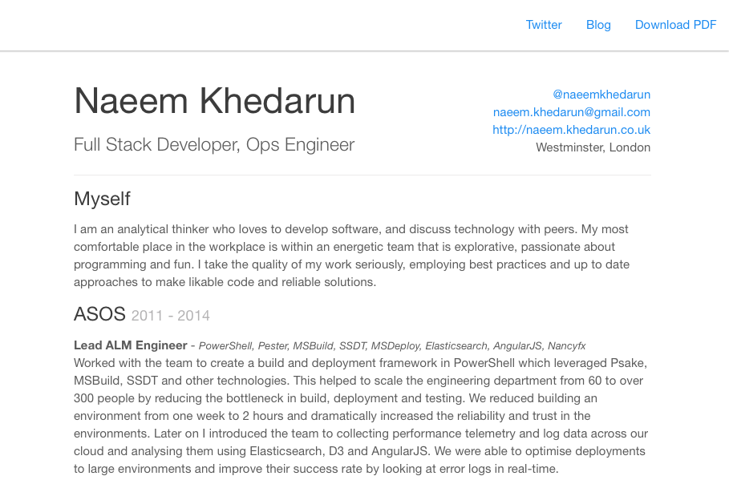

# A responsive web c.v.

This is my c.v. written as a responsive web page using [bootstrap](http://getbootstrap.com/) and the [paper](http://bootswatch.com/paper/) theme. It uses scss and includes a [gulp](http://gulpjs.com/) build to generate the stylesheets. Also included is a gulp task to generate a PDF using [wkhtmltopdf](https://code.google.com/hosting/moved?project=wkhtmltopdf). Extra formatting is applied using a pdf stylesheet to remove unnecessary web components such as navigation and to adjust the layout.

An example website can be found at [naeem.khedarun.co.uk](http://naeem.khedarun.co.uk) and sample PDF [here](http://naeem.khedarun.co.uk/naeemkhedarun.pdf).

The webpage is developed locally using [http-server (node)](https://www.npmjs.com/package/http-server) and mapped to a .dev domain using [invoker](http://invoker.codemancers.com/).

Check out the following blog entry for more details about the source: [sharpfellows.com](http://sharpfellows.com/post/publishing-your-c-v-on-the-web-and-exporting-pdf-with-added-gulp-and-bootstrap).

## Getting started

You will need a working [bower](http://bower.io/) installation.

    bower install bootstrap-sass-official
    bower install gulp gulp-clean gulp-load-plugins gulp-rename gulp-sass gulp-shell
    
And also [npm](https://www.npmjs.com).

    npm install -g http-server

## Compiling the stylesheets

Before you can run the site you will need to generate main.css. This can be done using gulp as follows:

    gulp sass

If you would like it to regenerate as you update the styles use:

    gulp watch

## Running site site

There is a .dev.ini file included in the root which you can rename to the name of your site if you would prefer. Inside you can change the name from [naeemkhedarun] to your own site name. 

    invoker start naeemkhedarun.dev.ini #Add -d to run as a daemon in the background

You should now be able to access the site at http://yourname.dev.

## Generating the PDF

Make sure you have [wkhtmltopdf](http://wkhtmltopdf.org/) installed with at least version 0.12. Open gulpfile.js and in the gulpsass task command line you can change both the location of your .dev site and the name of the exported pdf.

Then you can run the following to generate both main.css with the pdf override styles and the pdf itself.

    gulp pdfsass

## Hosting on Github

Github gives you a [User page](https://help.github.com/articles/user-organization-and-project-pages/) which feels like an appropriate place to put your c.v. and its quite easy to get up and running. Github uses a convention for user pages so create a repository called **username.github.io**. 

If you want a custom domain put into the root of your sites directory a file called **CNAME** and put in the domain name without the protocol. In mine I have:

    naeem.khedarun.co.uk

You can now push your repository up to github and within 30 minutes your page will be available at **http://username.github.io**. If you are using a custom domain add a CNAME record pointing your domain to **username.github.io**.

## Over to you

Please feel free to use the template in which ever way you like and I hope you find it useful. You can reach me on twitter at [@NaeemKhedarun](https://twitter.com/NaeemKhedarun)
